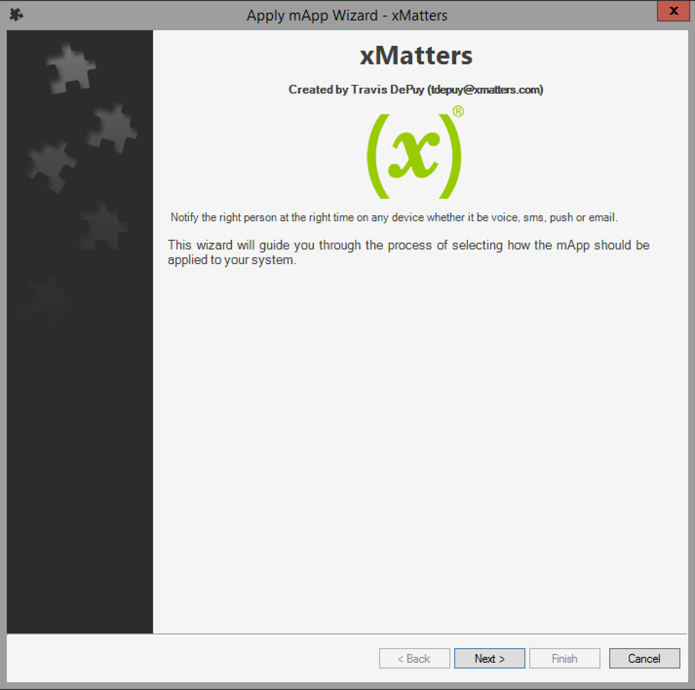
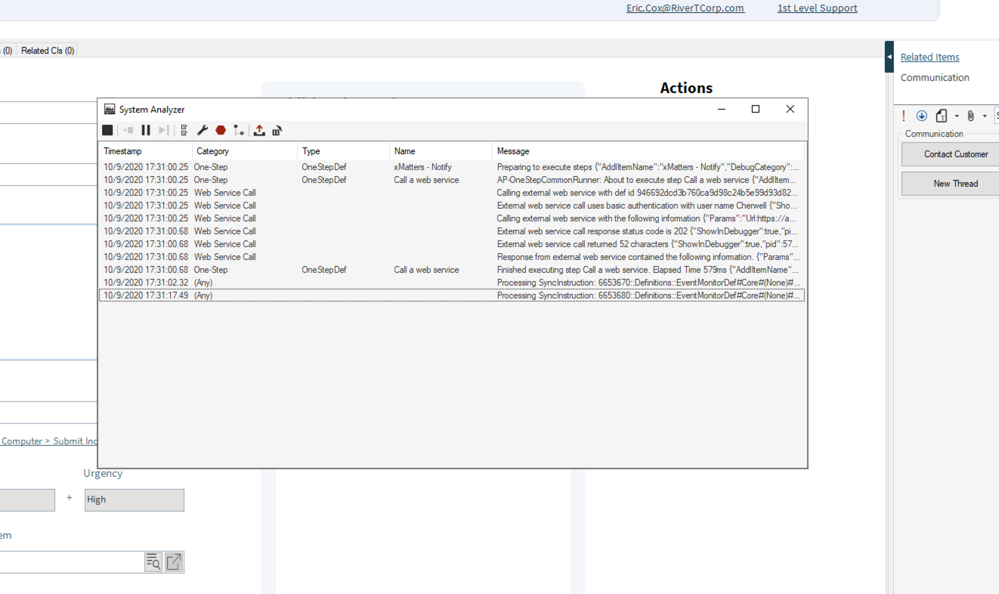

# Cherwell to xMatters Integration
Cherwell is a highly configurable service desk solution for keeping organizations running. This integration to xMatters provides extensive notification abilities across a variety of devices as well as access to the xMatters flow designer platform. Using the flow designer platform, teams can extend their incident response processes to quickly get the business back up and running. 

# Pre-Requisites
* Cherwell v10.1.1 or higher
* The [xMatters mApp](https://www.cherwell.com/marketplace/xmatters/)
* xMatters account - If you don't have one, [get one](https://www.xmatters.com)!

# Files
* [Cherwell.zip](Cherwell.zip) - The workflow containing the flow canvases and event forms.

# How it works
A One-Step in Cherwell is triggered manually to kick off the xMatters HTTP Trigger flow. The incoming payload is inspected and if the **Assigned To** field is populated, a new event is generated for the **Incident - Assigned To** form targeting the user in the Assigned To field. Cherwell sends over the **Full Name** of the user, so a lookup step does a search to find the user's xMatters targetName. It splits the full name on the first space. 
Alternatively, if the **Assigned To** is not populated, the **Incident - Assigned Group** form is triggered and the event targets the value of the **Assigned Group** field. 

<kbd>
   
</kbd>

On the **Incident - Assigned To** and **Incident - Assigned Group** canvases, there is an event status trigger that fires when the status of an event changes and a response trigger that fires when a user responds to the event. 

<kbd>
   
</kbd>

**Note**: An [Automation Process](https://help.cherwell.com/bundle/csm_administration_10_help_only/page/content/system_administration/automation_processes/managing_automation_processes.html) can be configured to automatically trigger the web service calls under a variety of condition instead of needing to trigger manually. 

# Installation

## xMatters set up

### Create a Cherwell user

1. Navigate to the Users menu and create a new user for Cherwell to authenticate with. Grant the **REST Web Service User** role. 

<kbd>
   
</kbd>

### Import the Workflow

1. Log in to xMatters as a Company Supervisor or a Developer and navigate to the Workflows page. Click the **Import** button and import the [Cherwell.zip](Cherwell.zip) file. 
2. Open the workflow and navigate to the Flows tab.
3. Click on the Incident canvas and then double click on the **Inbound from Cherwell** HTTP Trigger.

<kbd>
   
</kbd>

4. Copy the url and save for later. 
5. Return to the flows tab and open the **Terminate Events** canvas. Double click on the Terminate Events HTTP Trigger.
6. Copy the URL and save for later. 
7. On the flows tab, click the Components > Endpoints and select the Cherwell endpoint.
8. Update the **Base URL** and the **Access Token URL** values with the hostname of the Cherwell environment. Populate the Username, Password and Client ID if known. Otherwise they will be retrieved later in this document. 

<kbd>
   
</kbd>

9. On the Forms tab, click the **Not Deployed** dropdown next to **Incident - Assigned To** and select Sender Permissions. Add the cherwell user created above. 
10. Repeat for the **Incident - Assigned Group** form.
11. Click the gear icon and choose Editor permissions. Add the cherwell user here as well. 

If Cherwell is running behind a firewall and not publicly accessible, see the details [below](#running-behind-a-firewall) about using an xMatters agent. 

## Prepare the URLs

To make it a little easier to configure the Cherwell portion of the integration, you might want to prepare the URL now. To do this, paste the URL from the HTTP Trigger into a text editor, and then cut it into two parts:

1. **Hostname**: The part of the URL that identifies your xMatters instance (for example, `https://example.xmatters.com`)
2. **Integration URL**: The portion of the trigger URL that identifies the trigger (for example, `api/integration/1/functions/long-string-of-letters-and-numbers/triggers`)
Here's where those two parts are in the URL:

<kbd>
   
</kbd>

## Cherwell set up

### Create an xMatters User

1. Log in to the Cherwell Administrator interface and navigate to the **Security** menu. Click **Edit Users** and create a new user for xMatters. Make sure to grant the **IT Service Desk Manager** role to allow the user to update Incident records. 

<kbd>
   
</kbd>

2. Still in the Security menu, click the **Edit REST API client settings** link to display the dialog. Create a new REST API Client and copy the **Client Key**. 
3. Back in xMatters, navigate to the Flows tab and open the Components > Endpoints. On the Cherwell endpoint, enter the username, password and Client Key values. Enter a value in the Client Secret. Any value will do, adding a value tells the endpoint to save the Client Key and Secret. 

### Import and Configure mApp

1. Log in to the Administrator console and click the **mApps** menu. Click **Apply a mApp**.
2. Navigate select the [xMatters mApp](https://www.cherwell.com/marketplace/xmatters/) and navigate through the wizard.

<kbd>
   
</kbd>

3. On the last step, select **Open a Blueprint so that I can preview the changes**, since we need to make additional changes before the mApp can be published, then click Finish.

<kbd>
   
</kbd>

4. Click **Managers > Web Services** to display the Web Services Manager. When the dialog is displayed, right-click on the **xMatters** icon and select Edit.
5. In the URL field, paste the hostname portion of the Incident URL copied from above (or just enter the hostname of your xMatters instance). 
6. Now click Methods, and then select the **Create Event** method and click Edit.
In the Endpoint field, paste the Integration URL portion of the New Incident One Step inbound integration URL.
The endpoint entry should not begin with a slash (/).
7. Repeat for the **Terminate Events** method, using the **Terminate Events** HTTP Trigger URL. 
8. Save the Blueprint, then click **Scan Blueprint** on the left-hand menu. If that is successful, click the **Publish Blueprint** link.

### Reload definitions

After you publish the blueprint, you're prompted to reload definitions.

1. Head over to the Cherwell desktop client (not the Administrator Console we were working in above).
2. Click Help and select Reload definitions.

# Running Behind a Firewall

The [xMatters Agent](https://help.xmatters.com/ondemand/xmodwelcome/xmattersagent/xmatters-agent-topic.htm) can be installed on a server and it will make an outbound websocket connection over HTTP**S** to the xMatters cloud environment. Steps can be configured to excute on this agent and the URLs will resolve locally. This makes it nice for when Cherwell is running behind a firewall and is not available on the public internet.
After installing the agent on a server that has a network path to the Cherwell environment, log in to the xMatters instance and navigate to the Cherwell workflow. Navigate to the Flows tab and open the **Incident - Assigned To** canvas. Double click on one step with the Cherwell logo and navigate to the **Run Location** tab. Change the Run Location to xMatters Agent and select the appropriate agent. 

<kbd>
   
</kbd>

Repeat for all the steps on this canvas, then again for all the steps on the **Incident - Assigned Group** canvas.

Make sure to update the Cherwell endpoint (Components > Endpoints) to have the correct hostname for the Cherwell server. 

# Testing
Navigate to an open Incident and click **One-Step** from the top menu and click the **xMatters - Notify** step then click **Run**.

<kbd>
	
</kbd>

This will gather the details of the incident and send the web service call to xMatters. You can see the incoming request in the **Activity Stream** on the **Incident** canvas. This is where the request is parsed and then routed to the **Incident - Assigned To** or **Incident - Assigned Group** forms. 

<kbd>
	
</kbd>

If everything is green, a new event will be shown in the **Recent Events** report:

<kbd>
	
</kbd>

# Troubleshooting
If the event is not being created in xMatters, the first thing to check is the [System Analyzer](https://help.cherwell.com/bundle/csm_administration_10_help_only/page/content/system_administration/system_analyzer/run_the_system_analyzer.html). Open the System Analyzer and then execute the One-Step and inspect the results for any errors.

<kbd>
   
</kbd>

If there are no errors there, navigate to the xMatters **Incident** canvas and open the Activity Stream for any errors. 

Finally, if the event exists, check the Recent Events report for the event and inspect the Event Log for any errors targeting or notifying the recipients. 
